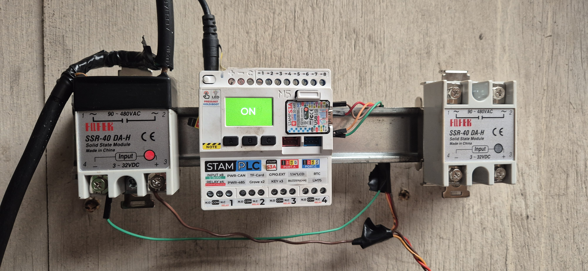
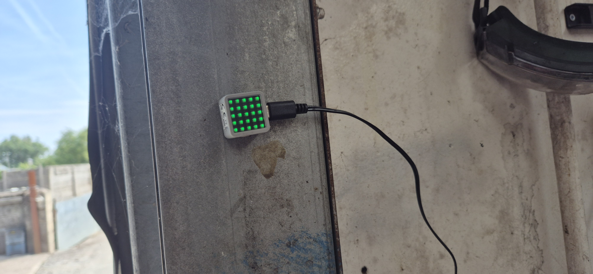
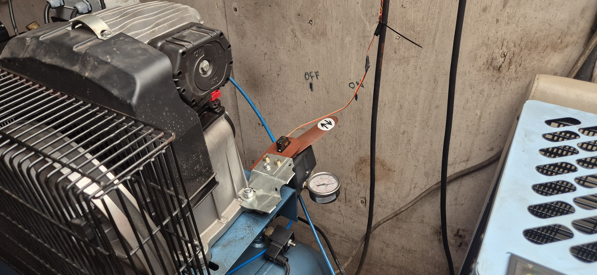
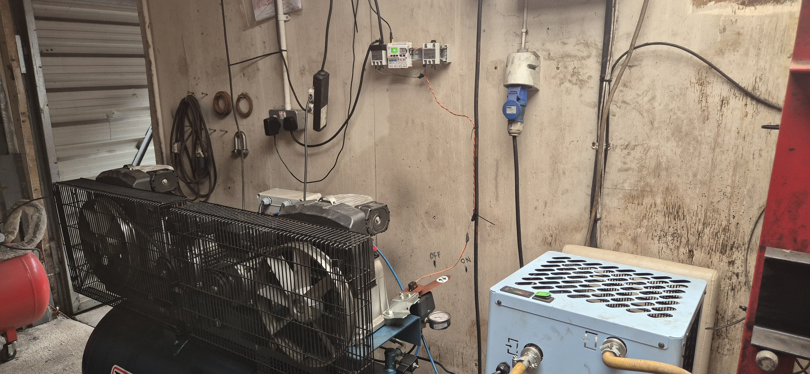
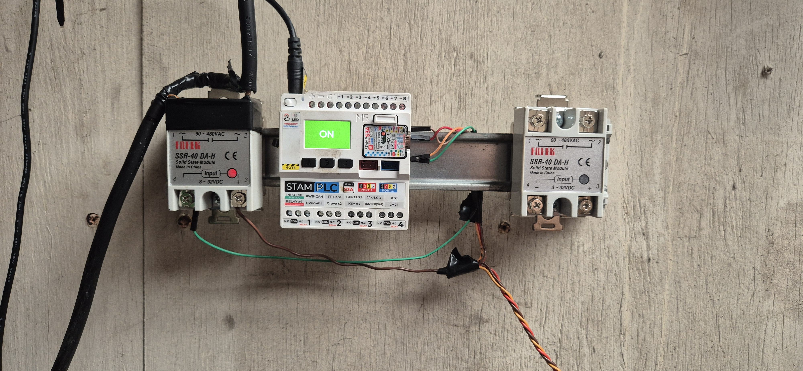

<div align="center">

# ⚡ StamPLC-Matrix

**Industrial-style compressor controller** built on M5Stack StamPLC + Atom Matrix,
with web UI, ESP-NOW remote, daily schedule, and a physical servo indicator on the compressor lever.




</div>

---

## What it does

A workshop air compressor gets:

- **A modern touch-friendly web UI** at `http://<stamplc-ip>/` — one big button, per-weekday auto-ON / auto-OFF schedule, live clock, timezone offset saved to flash.
- **A remote hardware button** (Atom Matrix) mounted on the workshop cabinet — one tap to toggle, glows solid green when running, screen goes fully dark when off (zero LED current, silent listening).
- **Real physical status indicator** — a hobby servo moves the OFF/ON lever painted on the wall so you can read the state from across the shop.
- **Simple HTTP API** — 3 endpoints, plain-text `ON`/`OFF` replies, ideal for cron / home-automation / external servers. See [`docs/api.md`](docs/api.md).
- **ESP-NOW peer channel** — primary control link between StamPLC ↔ Atom Matrix, works even if WiFi is dead.
- **Persistent state** — schedule and timezone offset survive power cuts (`schedules.json`, `tz.json` on flash).

---

## In the wild

<table>
<tr>
<td width="50%">

**Atom Matrix on the workshop cabinet**
Solid green = compressor running. Tap once to toggle.
Zero LED current when idle (screen fully off).



</td>
<td width="50%">

**Servo on the compressor's OFF/ON lever**
Painted labels on the wall, servo arm physically indicates state.
No holding torque — signal is cut after each move to save power.



</td>
</tr>
<tr>
<td colspan="2">

**Workshop overview** — StamPLC on the wall between the compressor and the air dryer,
Atom Matrix in view of the operator.



</td>
</tr>
<tr>
<td colspan="2">

**Control panel — StamPLC on DIN rail with two Fotek SSR-40 DA-H**
Left SSR: compressor main. Right SSR: reserved for a second load.



</td>
</tr>
</table>

---

## Architecture

```
                                     ┌──────────────────────┐
                                     │      Any browser     │
                                     │  http://<stamplc>/   │
                                     │  (phone / laptop)    │
                                     └──────────┬───────────┘
                                                │  HTTP GET
                                                ▼
    ┌──────────────────┐   ESP-NOW    ┌──────────────────────┐   PWM   ┌──────────┐
    │  Atom Matrix     │◄────────────►│      StamPLC         │────────►│  Servo   │
    │  (ESP32)         │              │      (ESP32-S3)      │         └──────────┘
    │                  │              │                      │
    │  5x5 RGB display │◄─── HTTP ───►│  Web UI + JSON API   │  GPIO
    │  1 button        │              │  Daily scheduler     │────────►┌──────────┐
    │                  │              │  Persistent state    │         │   SSR    │──► 220V
    └──────────────────┘              │  RTC + TZ offset     │         │  40 A    │    to
                                      │  LCD + 3 buttons     │         └──────────┘  compressor
                                      └──────────────────────┘
```

Three independent control surfaces stay in sync:

- **Web UI** (any browser on the LAN) → HTTP → StamPLC
- **Atom Matrix button** → ESP-NOW + HTTP → StamPLC
- **StamPLC's physical A/B/C buttons** → StamPLC itself

Every change the StamPLC makes is broadcast back over ESP-NOW and reflected in `/status`, so all surfaces always show the same state.

---

## Repository layout

```
StamPLC-Matrix/
├── README.md                 ← you are here
├── LICENSE                   ← MIT
├── stamplc/
│   └── main.py               ← StamPLC firmware (paste into UIFlow2)
├── atom_matrix/
│   └── main.py               ← Atom Matrix firmware (paste into UIFlow2)
└── docs/
    ├── api.md                ← HTTP API reference
    ├── hardware.md           ← wiring, GPIO map, bill of materials
    └── photos/               ← project photos referenced above
```

---

## Quick start

### 1. Flash

Both devices run **MicroPython under UIFlow2 v2.4** (M5Stack's web-based IDE):

1. Open <https://uiflow2.m5stack.com/>.
2. Connect the StamPLC via USB, switch to **Python** tab, paste [`stamplc/main.py`](stamplc/main.py), press **Download** (⬇).
3. Repeat for the Atom Matrix with [`atom_matrix/main.py`](atom_matrix/main.py).

### 2. Configure

Edit the config block at the top of each `main.py`:

```python
WIFI_SSID    = 'Your-WiFi'
WIFI_PASS    = 'your-password'
STAMPLC_IP   = '192.168.3.75'         # Atom Matrix needs the StamPLC's IP
STAMPLC_MAC  = 'B08184977268'         # Atom Matrix needs the StamPLC's MAC
```

The StamPLC's IP and MAC are printed in its serial console at boot. For a stable IP, set a DHCP reservation on your router.

### 3. Wire

See [`docs/hardware.md`](docs/hardware.md) for the full wiring diagram and safety notes.
Minimum:

- **G40** → servo signal (external 5 V for servo power, common GND)
- **G41** → SSR input negative, with **5 V OUT → SSR input positive** and a **10 kΩ pull-up** on G41 to 5 V (safe boot)
- Fuse the live wire, use a heatsink on the SSR, don't skip mains grounding

### 4. Use

Open `http://<stamplc-ip>/` from any device on the WiFi. You'll get:

- A live clock (tap it to set your timezone offset)
- The big **Compressor OFF / ON** button
- **Auto-OFF Schedule** with two locked permanent entries (12:55, 17:55 on Mon-Fri) and space to add your own
- **Auto-ON Schedule** for daily start times

---

## HTTP API

Full reference: [`docs/api.md`](docs/api.md). Three-line summary:

| Action | URL | Timeout |
|---|---|---|
| Turn ON | `GET http://<ip>/on` | 3 s |
| Turn OFF | `GET http://<ip>/off` | 3 s |
| Read state | `GET http://<ip>/status` | 2 s |

```bash
# Turn on every weekday at 08:00, from an external server
0 8 * * 1-5 curl -s -m 3 http://192.168.3.75/on
```

---

## Atom Matrix visual states

| State | Display |
|---|---|
| Booting | **Blue snake** spiral |
| WiFi connected | **Yellow snake** spiral |
| WiFi failed | **Red X** |
| Waiting for StamPLC response after button press | **White snake** (fast) |
| Compressor ON | Solid **green**, all 25 LEDs |
| Compressor OFF | **Screen off** (zero LED current) |

The matrix never changes optimistically — every state transition is confirmed by a real reply from the StamPLC (ESP-NOW broadcast or HTTP reply). If both channels fail, the button press produces no visible change and the state remains truthful.

---

## Features in detail

- **Idempotent `/on` and `/off`** — safe to retry, external schedulers don't need to check state first.
- **Non-blocking HTTP server** — the compressor can be mid-toggle (servo moving, chime playing) while the web page's `/status` polls continue queueing correctly.
- **Day-of-week schedule** — each entry has a 7-bit mask for weekdays. Defaults to Mon-Fri in the picker.
- **Permanent schedule entries** — hard-coded times (currently 12:55 and 17:55, Mon-Fri) can't be deleted from the UI.
- **Timezone offset** — tap the clock card, modal opens with live preview of "local will be", save with **Set**. Persists to `tz.json` on flash.
- **Confirmed-state model on Atom Matrix** — the display is a mirror of what the StamPLC *actually* did, not what the user asked for.
- **Dual-channel command send** — the Atom Matrix button fires ESP-NOW and HTTP in parallel. If one channel is down, the other still delivers.
- **HTTP status polling backup** — every 3 s the matrix polls `/status` as a final safety net against silent ESP-NOW loss.

---

## Roadmap ideas

- MQTT bridge for home-automation integration
- HTTPS with mTLS for internet-facing use
- Real-time pressure sensor readout on the web page
- Runtime hour counter for maintenance scheduling
- Rust port for the ESP32-S3 (single static firmware, no MicroPython runtime)

---

## Author

Built by **Andrii Sukhodieiev** — <https://astechlab.net/>

## License

[MIT](LICENSE)
